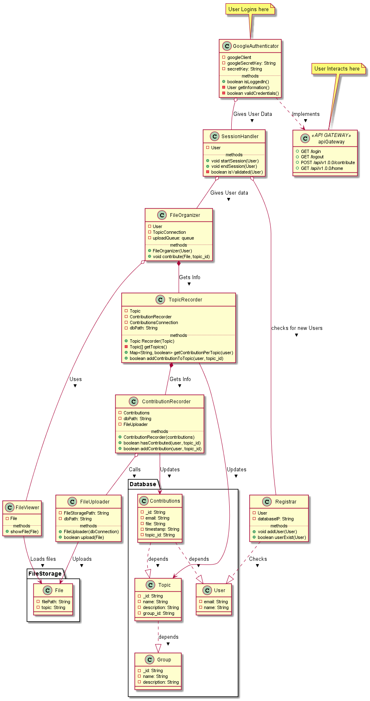

# Bahagian

This app is to share notes with people while filtering out freeloaders

## Getting Started

The main application is in `app` folder. Use `cd app` before excuting any commands

### Dependencies

- Sqlite
- Python 3.7.2
- Google drive API
- Oauth2

### Installing python libraries

Run the following to easily install dependencies `pip install -r requirements.txt`

### Running app

- `python app.py`

## Class Relations

